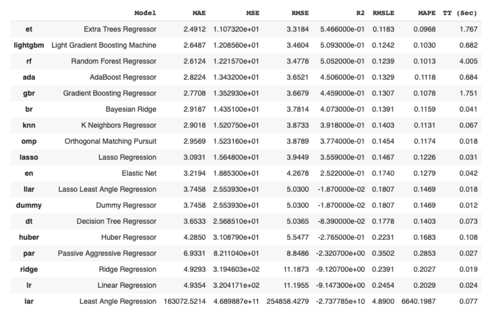
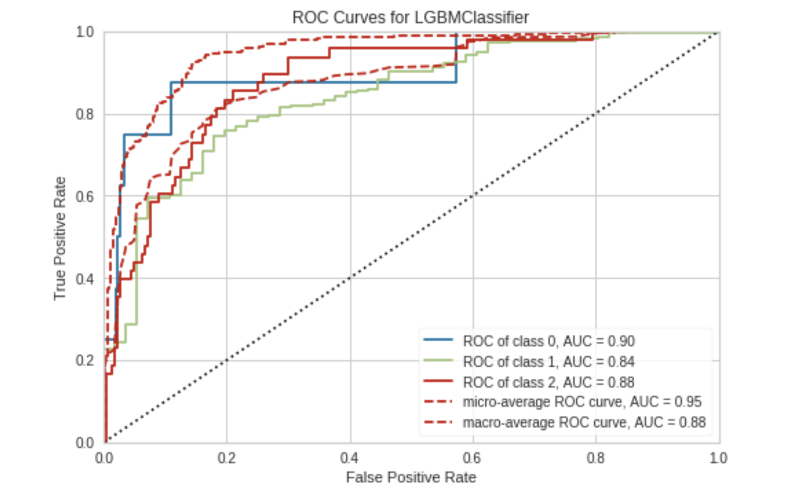
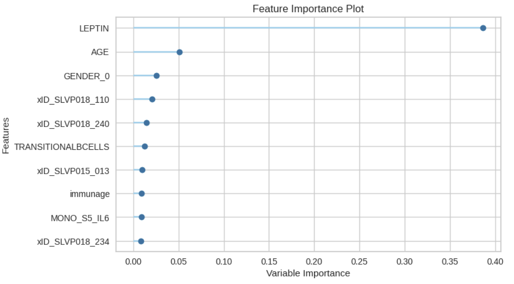
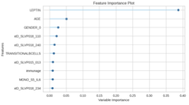

# CS229-BMI-prediction-using-immune-markers

## Table of contents
* [General info](#general-info)
* [Screenshots](#screenshots)
* [Technologies](#technologies)
* [Setup](#setup)
* [Features](#features)
* [Status](#status)
* [Inspiration](#inspiration)
* [Contact](#contact)

## General info
Understanding immune-metabolic relationships by modeling the association between Body Mass Index (BMI), adipokines and other immune markers helps to generate novel biological insight. Especially to help target immune-metabolic dysfunctions such as obesity, diabetes or cancer. We received a dataset of 170 immune markers and 902 participants from the Stanford 1000 Immunomes Project. Our aim is to generate a good model to predict BMI. To do so, we have screened different algorithms:
* Linear regression on a reduced feature space
* Regularization algorithms 
* PyCaret model selection 

<!--## Baseline Model
keras implementation (https://github.com/divamgupta/image-segmentation-keras/) -->
## Screenshots



<!-- -->

## Technologies
* python - version 3.6.5
* R
* pycaret==2.3.10
* markupsafe==2.0.1
* pyyaml==5.4.1 -qq
* scikit-learn==0.23.2
* matplotlib==3.1.3

<!--## Setup-->
<!--Available soon-->
<!--Describe how to install / setup your local environement / add link to demo version.-->

<!--## Code Examples
Show examples of usage:
```
from keras_segmentation.models.unet import unet_mini

model = unet_mini(n_classes=4,  input_height=96, input_width=96  )

model.train(
    train_images = "Dataset/train/",
    train_annotations = "Dataset/train_labels/",
    checkpoints_path = "Dataset/checkpoints",
    val_images = "Dataset/test/",
    val_annotations = "Dataset/test_labels/",
    epochs=50, validate=True, batch_size=8, 
    optimizer_name="adam",
    gen_use_multiprocessing=True,
    auto_resume_checkpoint=False,
    val_batch_size=2,
)
```

## Features
List of features ready and TODOs for future development
* Train on 3 different U-NET architecture variants-->

## Results
From feature selection, regularization analysis and the general screening, we can see that model performance is quite similar ( RMSE ∼ 3) and no model offers a very good approximation to BMI yet. Also, in all approaches, leptin, gender and age have come up as the most important features to focus on, as expected and discussed with our mentor.

## Status
Project is: _finished_ <!-- a normal html comment _finished_, _no longer continue_ and why?-->

## Report
CS229 Summer 2022 (CS229__BMI_prediction_using_immune_markers.pdf)

<!--## Inspiration-->
<!--Add here credits. Project inspired by..., based on...-->

<!--## Contact-->
<!--Created by [@flynerdpl](https://www.flynerd.pl/) - feel free to contact me!-->
